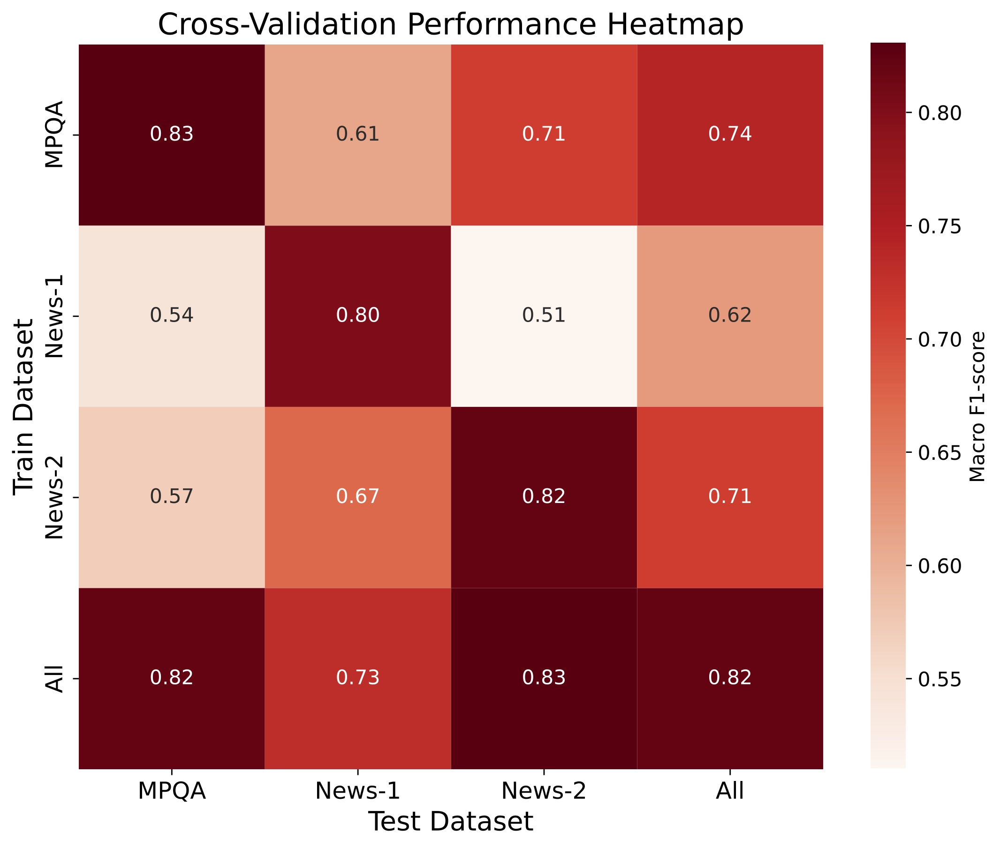

# subjectivity_detector

We have three different datastets labeled for subjectivity classification. MPQA, News-1 and News-2.

We train a baseline model in different settings on these datasets:
* Multi-Dataset Learning: where we train and test in cross-validation setting.
* Multi-task Learning: where we view each dataset as a different task and allocate it's own classification head to it. 


To train the model on a given dataset(MPQA), run the following code:

```python
python train.py --dataset_name MPQA
```

And to test a model trained on a particular dataset(MPQA), on a different dataset(News-1), run the following code:
```python
python test.py --train_dataset_name MPQA --test_dataset_name News-1
```

## Performance Results


